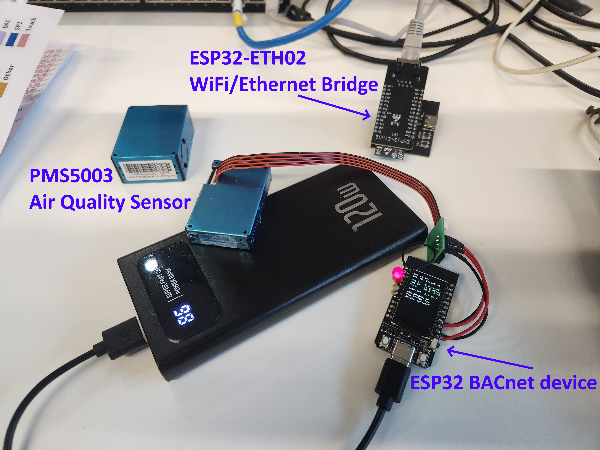
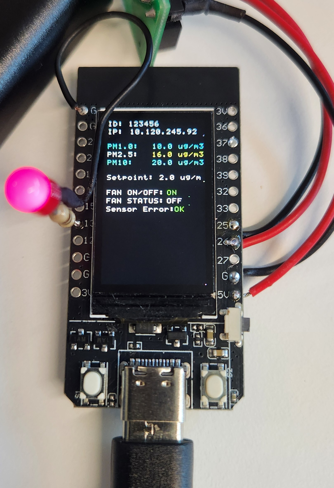
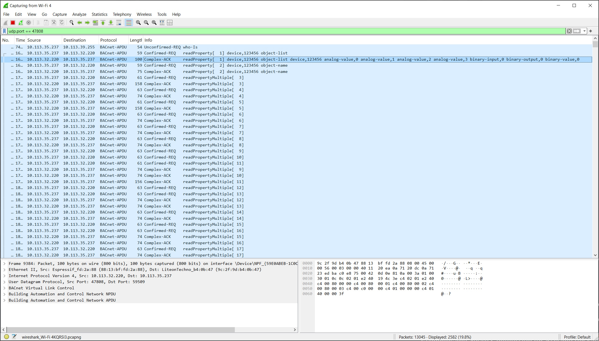

# ESP32 BACnet IP device

ESP32 BACnet/IP, PMS5003 Air Quality sensor, ST7789 display (LVGL).

NOTE: the new project https://github.com/MGuerrero31416/BACnet-ESP32-Display is cleaner and more advanced than this one. This one is a mashup from Lukedukeus esp32-bacnet-master-v5.0. 

BACnet-ESP32-Display has been properly generated using bacnet-stack library and modifying the functions for compatibility with ESP-IDF v5.5.1. It is easier to make modifications on the new BACnet-ESP32-Display

I keep this one temporarily because it has the PMS5003 funciton, but I will delete when I add that function as a fork of the new BACnet-ESP32-Display

## Description

* ESP32 programmed as Wireless BACnet device. 
* This example is for a PMS5003 Air Quality sensor. It has a standalone program to start a Fan when the PM2.5 level is above the Setpoint.
* It uses bacnet-stack
* Programmed on ESP-IDF v5.5.1.

* You can use any Wifi/Ethernet bridge to connect it to your Building Management System LAN. I have programmed a ESP32-ETH02 for that purpose. I will share the project soon.

* Tested with YABE and with Johnson Controls Metasys.

This is my first ESP-IDF program. I used the assistance of DeepSeek and Grok.
Suggestions, improvements, and variations are welcome.

### Analog Value objects:
* PM1_0_OBJECT_INSTANCE          0  // Instance 0 for PM1.0
* PM2_5_OBJECT_INSTANCE          1  // Instance 1 for PM2.5
* PM10_OBJECT_INSTANCE           2  // Instance 2 for PM10
* PM2_5_SETPOINT_OBJECT_INSTANCE 3  // Instance 3 for PM2.5_SETPOINT

### Binary Input Objects:
* FAN_STATUS_OBJECT_INSTANCE     0  // Instance 0 for FAN_STATUS

### Binary Output objects:
* FAN_COMMAND_OBJECT_INSTANCE    0  // Instance 0 for FAN_COMMAND

### Binary Value objects:
* SENSOR_ERROR_OBJECT_INSTANCE   0  // Instance 0 for SENSOR_ERROR

## Wiring
* PMS5003 TX  -> ESP32 GPIO25 (RX1)
* PMS5003 RX  -> ESP32 GPIO26 (TX1)
* FAN STATUS  -> ESP32 GPIO35 (Digital Input)
* FAN COMMAND -> ESP32 GPIO13 (Digital Output)
* ST7789 display -> GPIO pinout defined at file display_driver.c

Tested with these ESP32 boards with integrated display:
* TTGO ESP32 T-Display V1.1 IPS ST7789 1.14" 135x240.
* ideaspark ESP32 1.9" TFT LCD 170x320.
It took me a while to reconfigure the non-standard colors on LVGL!

### Dependencies

* BACnet Stack already preinstalled at components\bacnet. Modified for this project
* User Fonts at components\fonts

### Settings

* BACnet Stack already preinstalled at components\bacnet. Modified for this project.
* User Fonts at components\fonts.
* Change WiFi SSID and Password at wifi.c
* Preconfigured with Static IP, defined at wifi.c Change it here:
```
/* ------------------- STATIC IP CONFIGURATION ------------------- */
    esp_netif_t *sta_netif = esp_netif_get_handle_from_ifkey("WIFI_STA_DEF");
    if (sta_netif == NULL) {
        ESP_LOGE(TAG, "Failed to get STA netif handle");
    } else {
        ESP_ERROR_CHECK(esp_netif_dhcpc_stop(sta_netif));  // Disable DHCP

        esp_netif_ip_info_t ip_info = {0};

        ip_info.ip.addr      = htonl((10UL << 24) | (120UL << 16) | (245UL << 8)  | 92UL);   // 10.120.245.92
        ip_info.gw.addr      = htonl((10UL << 24) | (120UL << 16) | (245UL << 8)  | 254UL);  // 10.120.245.254
        ip_info.netmask.addr = htonl((255UL << 24) | (255UL << 16) | (255UL << 8) | 0UL);    // 255.255.255.0

        ESP_ERROR_CHECK(esp_netif_set_ip_info(sta_netif, &ip_info));

        ESP_LOGI(TAG, "Static IP assigned: 10.120.245.92");
    }
    /* --------------------------------------------------------------- */
```
If you require dynamic IP, rename wifi.c_DHCP as wifi,c

## Pending to do:

* SENSOR_ERROR pending debug. It shall get it from the serial input.
* Currently programming the ESP32 as BACnet SM/TP using a RS485 module.

## Authors

Manuel Guerrero

## Version History


* 0.1
    * Initial Release


## Acknowledgments

* [Lukedukeus esp32-bacnet-master-v5.01](https://github.com/lukedukeus/esp32-bacnet-master-v5.01)

## Pictures 






